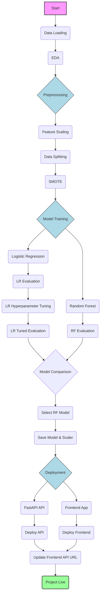

# Credit Card Fraud Detection Project Flow

This diagram illustrates the end-to-end workflow of our Credit Card Fraud Detection project, from data ingestion and preprocessing to model deployment.

```mermaid
graph TD
    A[Start] --> B(Data Loading)
    B --> C(EDA)
    C --> D{Preprocessing}
    D --> D1(Feature Scaling)
    D1 --> D2(Data Splitting)
    D2 --> D3(SMOTE)
    D3 --> E{Model Training}

    E --> F(Logistic Regression)
    F --> G(LR Evaluation)
    G --> H(LR Hyperparameter Tuning)
    H --> I(LR Tuned Evaluation)

    E --> J(Random Forest)
    J --> K(RF Evaluation)

    I --> L{Model Comparison}
    K --> L
    L --> M(Select RF Model)
    M --> N(Save Model & Scaler)

    N --> O{Deployment}
    O --> P(FastAPI API)
    O --> Q(Frontend App)

    P --> R(Deploy API)
    Q --> S(Deploy Frontend)

    R --> T(Update Frontend API URL)
    S --> T
    T --> U(Project Live)

    style A fill:#f9f,stroke:#333,stroke-width:2px
    style U fill:#9f9,stroke:#333,stroke-width:2px
    style D fill:#add8e6,stroke:#333,stroke-width:1px
    style E fill:#add8e6,stroke:#333,stroke-width:1px
    style O fill:#add8e6,stroke:#333,stroke-width:1px
```