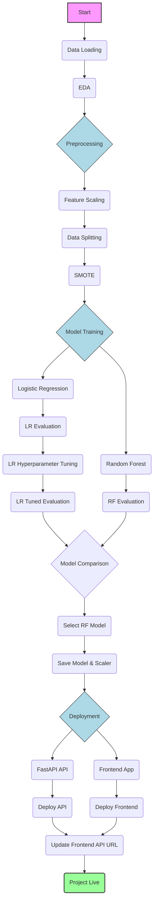

# Credit Card Fraud Detection

This repository contains a machine learning project focused on detecting fraudulent credit card transactions. The project demonstrates a complete end-to-end pipeline, from data preprocessing and model training to evaluation and preparation for deployment.

## Project Overview

Credit card fraud detection is a classic example of an imbalanced classification problem, where fraudulent transactions are extremely rare compared to legitimate ones. This project addresses this challenge by employing appropriate techniques for data handling and model evaluation.

## Project Flow

The following diagram illustrates the key stages of this project:

## Key Components

*   **Jupyter Notebook (`credit_card_fraud_detector.ipynb`)**: Contains the full machine learning pipeline, including data loading, EDA, preprocessing (scaling, SMOTE), model training (Logistic Regression, Random Forest), hyperparameter tuning, and evaluation.
*   **Data (`creditcard.csv`)**: The dataset used for training and testing the models.
*   **API (`api_app/`)**: A FastAPI application that serves predictions from the trained machine learning model.
*   **Frontend (`frontend_app/`)**: A simple web interface built with HTML, CSS, and JavaScript to interact with the prediction API.
*   **Model & Scaler**: Saved `joblib` files of the trained Random Forest model and the `StandardScaler` used for preprocessing.

